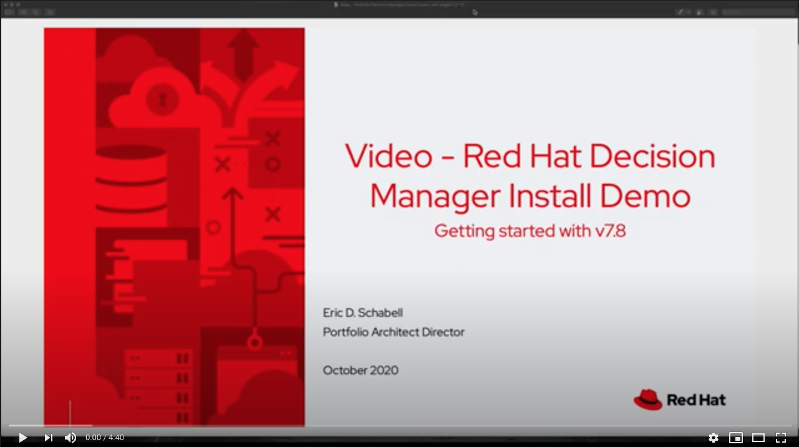
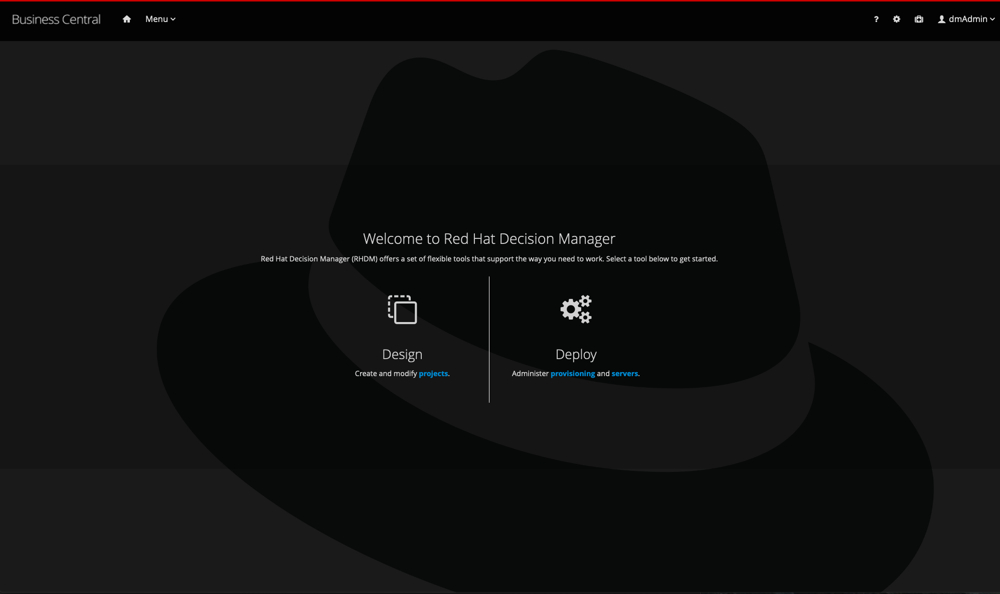

Red Hat Decision Manager 7 Install Demo
=======================================
Project to automate the installation of this product without preconfiguration beyond a single admin user.

You can install this project on your own machine or on an OpenShift Container Platform.

Installing on local machine
---------------------------
1. [Download and unzip](https://github.com/jbossdemocentral/rhdm7-install-demo/archive/master.zip) 
   or [clone this repo](https://github.com/jbossdemocentral/rhdm7-install-demo.git).

2. Add products to installs directory, see installs/README for details and links.

3. Run 'init.sh' or 'init.bat' file. 'init.bat' must be run with Administrative privileges

Follow install output instructions and log in to http://localhost:8080/decision-central (u:dmAdmin / p:redhatdm1!)

Kie Server access configured (u: kieserver / p:kieserver1!)

Enjoy installed and configured Red Hat Decision Manager. If you need more help, see the [install video](https://youtu.be/7Vpf9i1yJXU).

Installing on OpenShift Container Platform (CodeReady Containers)
----------------------------------------------------------------
Install this demo on your local machine using an OpenShift Container Platform development cluster can be 
done using CodeReady Continers. It's fully automated and delivers a fully functioning container-native 
development experience:

[CodeReady Containers Red Hat Decision Manager Easy Install Demo](https://gitlab.com/redhatdemocentral/crc-rhdm-install-demo)

Installing on any OpenShift Container Platform (generic)
-------------------------------------------------------
This demo can be installed on your own version of OpenShift Container Platform. Options and guidance can be found in the [openshift support directory README](support/openshift/README.md)

Supporting Articles
-------------------
- [Video - Red Hat Decision Manager Install Demo](https://youtu.be/7Vpf9i1yJXU)

- [Video - CodeReady Containers Red Hat Decision Manager Install](https://youtu.be/tn3LjSE7c6I) 

- [CodeReady Containers - Getting Started with OpenShift 4.5 and Decision Management Tooling](https://dzone.com/articles/codeready-containers-getting-started-with-openshif)

- [Getting Started with Red Hat Decision Manager 7](https://developers.redhat.com/blog/2018/03/19/red-hat-decision-manager-7/)

Released versions
-----------------
See the tagged releases for the following versions of the product:

- v1.10 - Red Hat Decision Manager 7.12.0 GA
- v1.9 - Red Hat Decision Manager 7.11.0 GA
- v1.8 - Red Hat Decision Manager 7.10.0 GA
- v1.7 - Red Hat Decision Manager 7.9.0 GA
- v1.6 - Red Hat Decision Manager 7.8.0 GA
- v1.5 - Red Hat Decision Manager 7.7.0 GA
- v1.4 - Red Hat Decision Manager 7.5.0.GA
- v1.3 - Red Hat Decision Manager 7.3.0.GA
- v1.2 - Red Hat Decision Manager 7.2.0.GA
- v1.1 - Red Hat Decision Manager 7.1.0.GA
- v1.0 - Red Hat Decision Manager 7.0.0.GA

